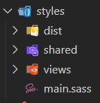

# Frontend Mentor - Product preview card component solution

This is a solution to the [Product preview card component challenge on Frontend Mentor](https://www.frontendmentor.io/challenges/product-preview-card-component-GO7UmttRfa). Frontend Mentor challenges help you improve your coding skills by building realistic projects. 

## Table of contents

- [Overview](#overview)
  - [The challenge](#the-challenge)
  - [Screenshot](#screenshot)
  - [Links](#links)
- [My process](#my-process)
  - [Built with](#built-with)
  - [Useful resources](#useful-resources)
- [Author](#author)

## Overview

### The challenge

Users should be able to:

- View the optimal layout depending on their device's screen size
- See hover and focus states for interactive elements

### Screenshot

### Links

[Netlify](https://guileless-puffpuff-f9871a.netlify.app)

## My process

### Built with

- SASS Variables, Files and Folders
- Compiled CSS as entrypoint from SASS
- Include fonts, style, images on HTML
- Simplest HTML5 Markup
- [SASS](https://sass-lang.com) - SASS

## Author

- Github - [P4ndev](https://github.com/p4ndev)
- LinkedIn - [P4ndev](https://www.linkedin.com/in/p4ndev)
- FrontendMentor.io - [P4ndev](https://www.frontendmentor.io/profile/p4ndev)